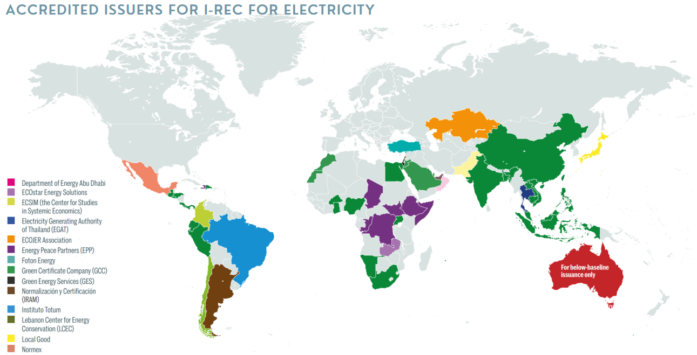

# FAQ

## What are RECs?

Understanding the nuances between attributional and consequential accounting is crucial for accurately reporting and interpreting the impact of renewable energy purchases and carbon offset projects within the GHG Protocol framework. RECs play a vital role in facilitating renewable energy adoption and Scope II emissions reporting. However, to drive meaningful reductions in global GHG emissions, it is essential to complement REC purchases with strategies that demonstrate real-world emission reductions, guided by the principles of consequential accounting. The GHG Protocol provides a robust framework for companies to navigate these complexities, supporting informed decision-making and effective climate action.

## Renewable Energy Credits (RECs) Explained

RECs serve as market-based instruments designed to promote the generation and use of renewable energy. Each REC represents proof that one megawatt-hour (MWh) of electricity has been generated from a renewable energy source, such as solar, wind, hydroelectric, or biomass, and injected into the shared system of power lines which transport electricity. While RECs signify the generation of renewable energy, they inherently do not ensure that the specific electricity consumed by the REC purchaser comes from a renewable source due to the interconnected nature of electricity grids. This separation of renewable energy attributes from the physical electricity allows RECs to be traded independently, providing flexibility in how entities claim renewable energy usage and manage their environmental impacts.

## Attributional vs. Consequential Accounting in GHG Protocol

### **Attributional Accounting**

Attributional accounting is pivotal in the GHG Protocol's methodology for Scope II emissions, which relate to indirect emissions from the consumption of purchased electricity, steam, heating, and cooling. This accounting method allocates emissions to entities based on their electricity consumption, ensuring that the sum of Scope II emissions reported by all entities matches the total Scope I (direct emissions) reported by electricity producers. It provides a "snapshot" of an entity's environmental impact, focusing on accurately distributing responsibility for emissions among different market participants without considering the broader implications of those emissions on global carbon levels.

### **Consequential Accounting**

Consequential accounting, on the other hand, evaluates the impact of specific actions on overall carbon emissions. It is concerned with the change in emission levels that result from particular activities, such as investing in renewable energy projects, compared to a baseline scenario where such activities did not occur. This method requires that any claimed carbon reductions or offsets be additional, meaning they are a direct outcome of the activity encouraged by the carbon market. Consequential accounting is crucial for assessing the real-world impact of carbon abatement strategies and informing policy and investment decisions that aim to reduce global GHG emissions effectively.

## Application in the GHG Protocol

The GHG Protocol recognizes the importance of both attributional and consequential accounting methods, particularly in the context of Scope II emissions and carbon offset projects.

* **Market-Based Reporting Method**: Under the Scope II Guidance of the GHG Protocol, entities can use RECs to claim reductions in their Scope II carbon footprint. By purchasing RECs, an entity essentially ensures that an equivalent amount of renewable energy has been added to the grid, offsetting the non-renewable portion of the electricity it consumes. This approach aligns with the attributional accounting principle, facilitating a transparent method for entities to report their renewable energy procurement and Scope II emissions reductions.
* **Consequential Accounting for Carbon Offsets**: The GHG Protocol also accommodates consequential accounting through its Policy and Action Standard and the GHG Protocol for Project Accounting. Projects that reduce emissions beyond business-as-usual scenarios—demonstrating additionality—can generate carbon offsets. These offsets, quantified using a consequential accounting framework, must be reported separately from Scope II emissions. This distinction emphasizes the additional impact of such projects on reducing overall GHG emissions, beyond merely reallocating emissions among market participants.


For more information, see the EPA page for [Renewable Energy Certificates (RECs)](https://www.epa.gov/green-power-markets/renewable-energy-certificates-recs#two)




## What are REC Registries?

North America

Europe

International

Can PECs be use for carbon offsetting?

While PECs provide a robust and transparent way to account for the carbon impact of electricity consumption and production, it is essential to understand their limitations and avoid misuse. In particular, PECs are not designed to be used as carbon credits and should not be used to offset Scope 1 (direct) or Scope 3 (indirect) emissions outlined in the GHG Protocol.

Scope 1 emissions are the direct emissions from owned or controlled sources, such as emissions from combustion in owned or controlled boilers, furnaces, vehicles, etc. Scope 3 emissions are all indirect emissions (not included in scope 2) that occur in the value chain of the reporting company, including both upstream and downstream emissions.

PECs are designed specifically for the power market and are intended to account for the indirect emissions associated with electricity consumption (Scope 2 emissions). They measure the avoided emissions associated with renewable energy generation and the induced emissions associated with electricity consumption.

Using PECs to offset Scope 1 or Scope 3 emissions would misuse the certificates and lead to inaccurate carbon accounting. It could also undermine the integrity of the PEC system and the credibility of the organizations using them.

Instead, organizations should use appropriate mechanisms for offsetting Scope 1 and Scope 3 emissions, such as purchasing verified carbon credits from projects that reduce or remove greenhouse gas emissions. These projects could include reforestation or afforestation projects, methane capture projects, or projects that reduce emissions through energy efficiency or the use of cleaner technologies.

Why use a public blockchain?

Blockchain-enabled registries can leverage smart contracts to automate various certificate issuance, transfer, and retirement processes. This can streamline the management of these instruments, reduce administrative costs, and improve the overall efficiency of the registry. The new registry can enhance transparency, security, and efficiency, address the limitations of current registries, and provide a robust foundation for scaling up climate action and achieving global decarbonization goals.

Benefits of Blockchain-based PECs:

1. **Transparency**: A public blockchain allows all PECs transactions to be recorded transparently and tamper-proof. This enables all stakeholders, including generators, offtakers, regulators, and the public, to easily access and verify the information related to the creation, transfer, and retirement of PECs.
2. **Traceability**: Blockchain technology can provide end-to-end traceability for PECs, ensuring that the avoided emissions from renewable energy generation can be accurately matched with the induced emissions of the offtaker. This traceability can help eliminate the possibility of double counting and enable more precise accounting of emissions reductions.
3. **Automation and Efficiency:** Blockchain technology enables the use of smart contracts, which can automate various processes related to PECs, such as issuance, transfer, and retirement. This can streamline the management of PECs, reduce administrative costs, and improve the overall efficiency of PPAs.

The transparent, traceable, and secure nature of blockchain technology can provide a robust foundation for PECs, enabling more accurate and credible claims of emissions reductions and ultimately fostering more effective decarbonization efforts in the electricity sector.A global registry would also address the issue of EAC brokerage. Currently, there exists a market for EAC brokerage, where intermediaries facilitate the trading of EACs between buyers and sellers. While these intermediaries provide a valuable service, they do not add value to the system to enhance the transparency, traceability, or integrity of EACs. By consolidating the separate registries into a single, unified platform, the global registry would eliminate the need for these intermediaries, thereby reducing the cost and complexity of trading PECs.

