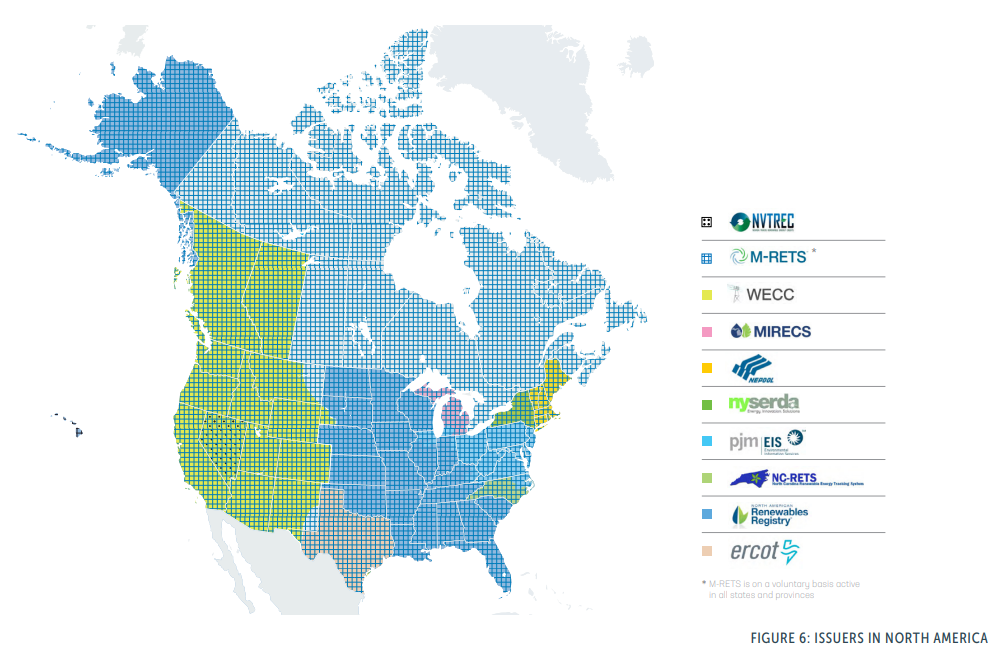
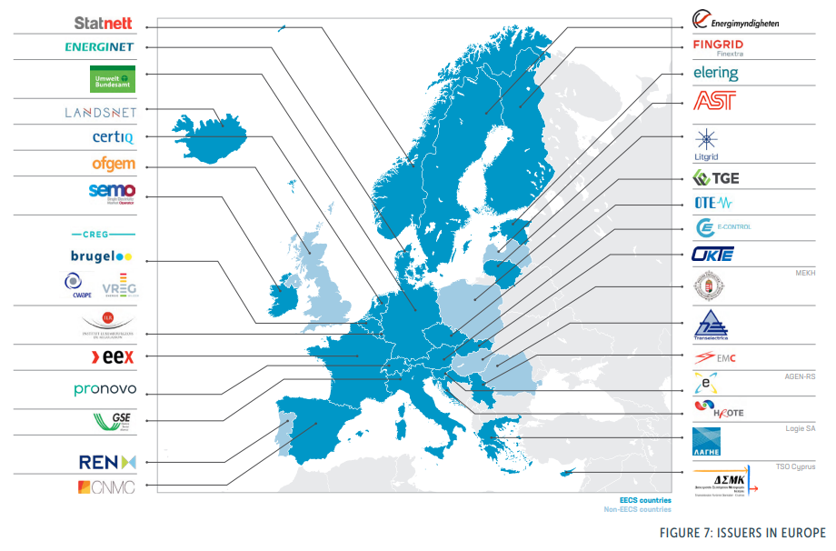
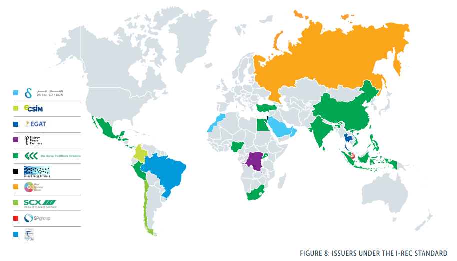

# The Need for a Global Registry

The current Energy Attribute Certificates (EACs) landscape is characterized by many separate registries worldwide. Each registry operates within its own jurisdiction, following its own set of rules and standards. This fragmentation presents a significant challenge for organizations seeking to procure renewable energy across different regions. It also hinders the transparency and traceability of renewable energy transactions, making it difficult to ensure the integrity of EACs and the associated claims.

### The Shared Atmosphere: A Unifying Factor 

The sharing of a single atmosphere further supports the concept of a global registry. Regardless of where they originate, greenhouse gas emissions contribute to global climate change. Therefore, reducing emissions anywhere in the world has a global impact. By denominating certificates in terms of carbon dioxide emissions avoided, the global registry directly links renewable energy procurement with global climate action.

Greenhouse gas emissions do not respect geographical boundaries. A ton of carbon dioxide emitted in one part of the world has the same impact on the global climate as a ton emitted elsewhere. Therefore, from a climate perspective, reducing emissions anywhere is beneficial.

<figure><figcaption></figcaption></figure>

Benefits include:

* Smart contracts automate settlement directing capital to project owners.
* Disintermediation is the process of cutting out the middleman, such as brokers and traders, to reduce costs, speed up transactions, and improve price transparency.
* Companies of all sizes can now easily participate, thanks to the disintermediation of siloed and non-interoperable platforms, resulting in a much better user experience.
* Aggregation of EACs on a single public platform, allowing for unrestricted purchase regardless of geography, democratizing the market.
* Price discovery based on true market value, not artificial constraints or predatory pricing by brokers.

